

<strong>CocinApp es una aplicación desarrollada en busca de una solución al desperdicio de comida</strong>

---

## Características principales

✨ Recetas basadas en ingredientes disponibles en la despensa 
📋 Lista de la compra con cantidad actualizada de la despensa  
🚀 Gestión de una despensa virtual

---

## Login, registro y recetas

  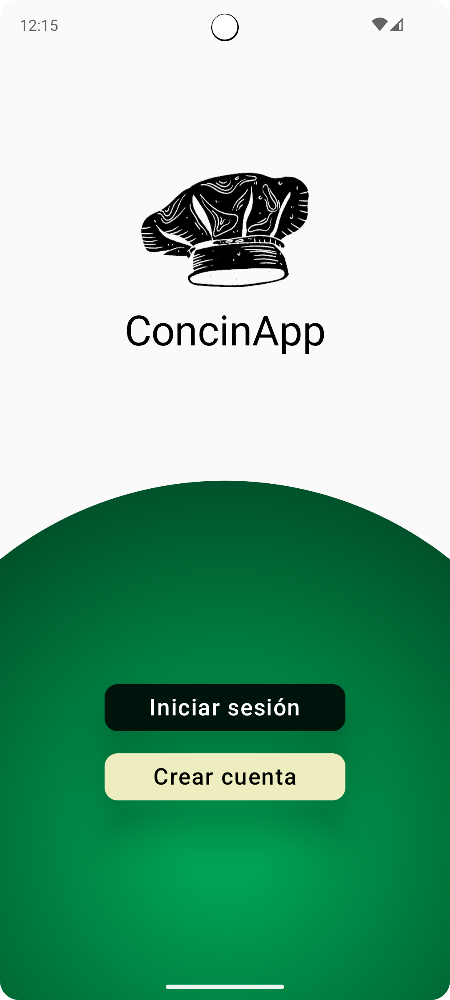
  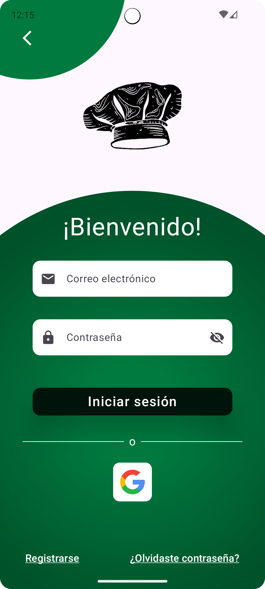
  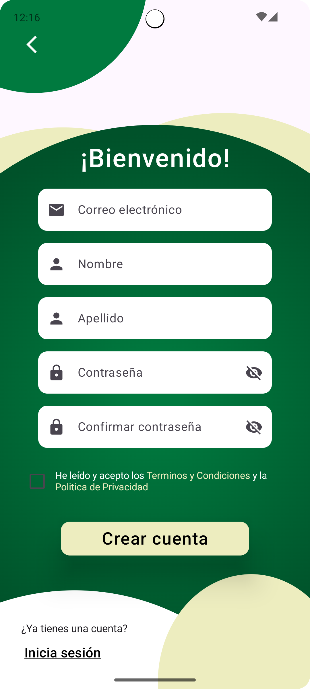
  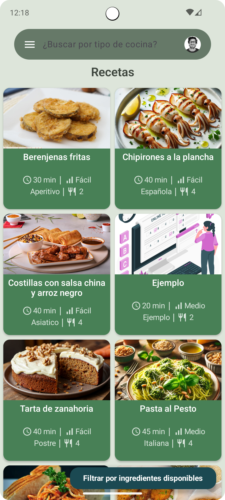

## Filtro, favoritos y despensa

  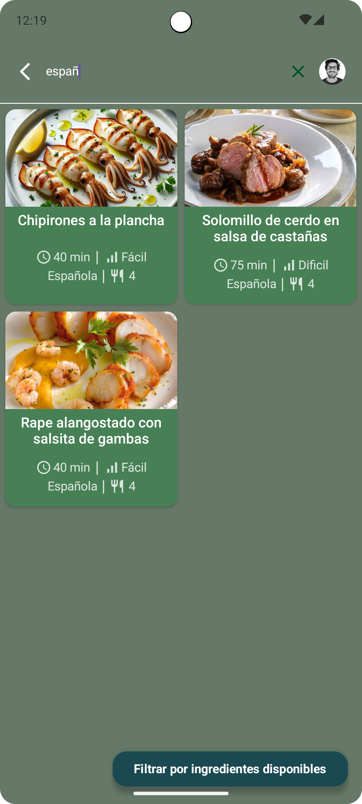
  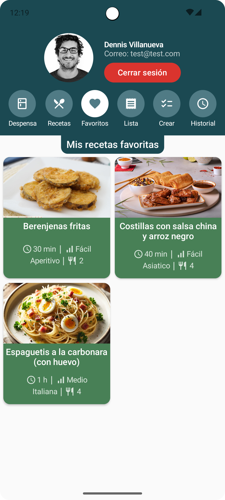
  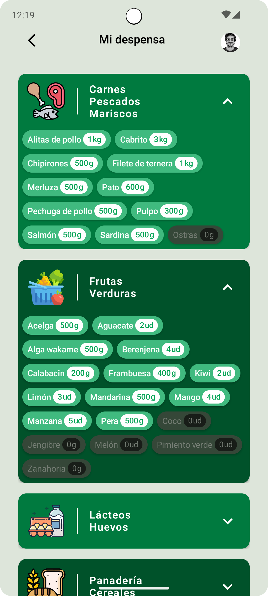
  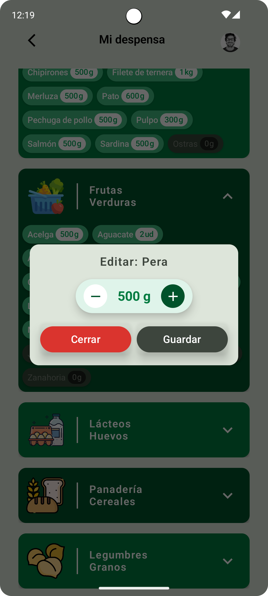

## Filtro, favoritos y despensa

  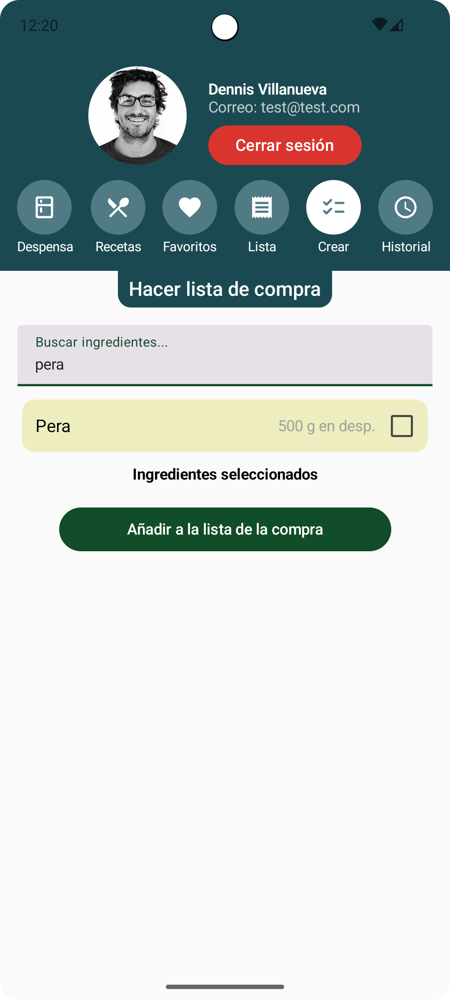
  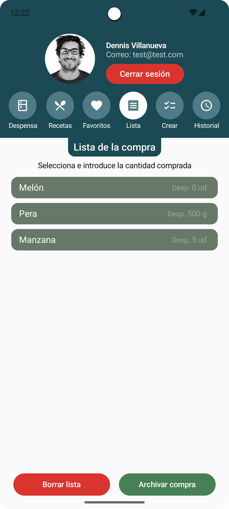
  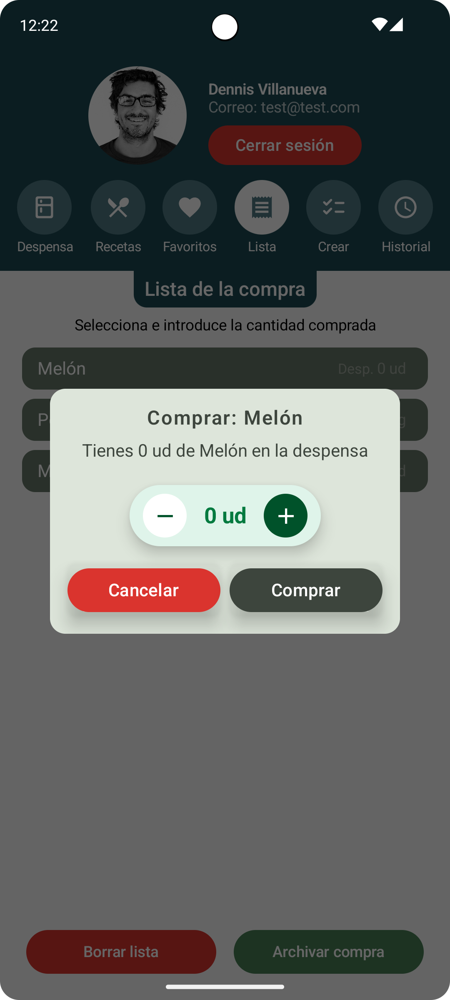
  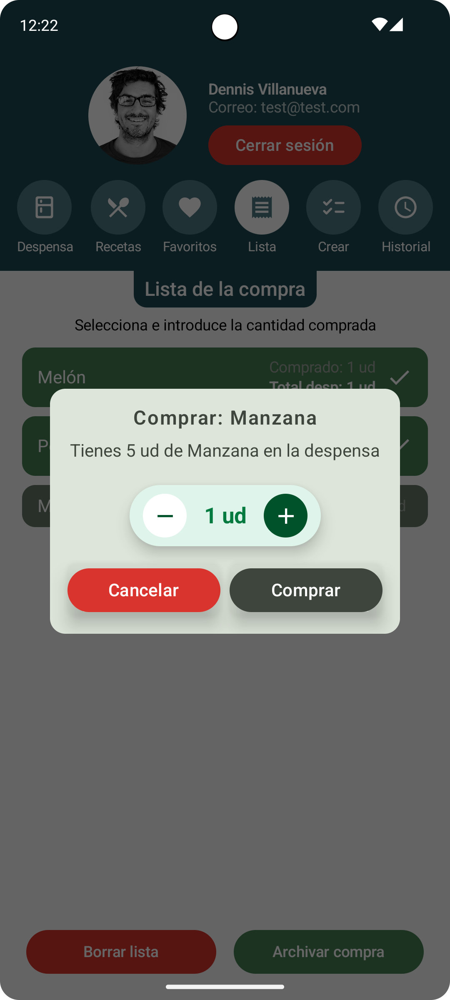

---

## Tecnologías utilizadas

🛠️ Kotlin 
🛠️ Jetpack Compose
🛠️ MVVM 

